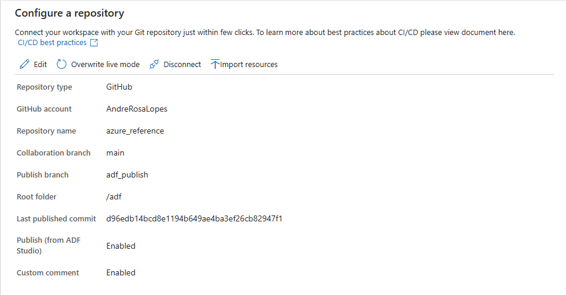

# 📘 Add GitHub Repository to Azure Data Factory

## **Description**

This step integrates Azure Data Factory with a GitHub repository to enable source control, versioning, and collaborative development.

Once configured, all changes in ADF (pipelines, datasets, linked services) will be saved as JSON files in the repository instead of being directly published to the dev environment. We just need to link ADF's dev environment to the GitHub repository.

This enables:

* Version control (history, rollback)
* Branch-based development (dev → main)
* Safer deployments
* Team collaboration

---

## 📊 Access & Permissions Summary

| Resource           | Principal            | Role / Permission        | Purpose                     |
| ------------------ | -------------------- | ------------------------ | --------------------------- |
| Azure Data Factory | Developer / Engineer | Data Factory Contributor | Configure Git integration   |
| GitHub Repository  | Developer            | Write / Admin            | Store ADF artifacts         |
| GitHub Repo        | Azure Data Factory   | OAuth Authorization      | Allow ADF to push/pull code |

---

# 🎯 Objective

Connect Azure Data Factory to a GitHub repository using the Azure portal UI.

---

# 🔹 Step 1 — Open Git Configuration

1. Go to your **Azure Data Factory instance**
2. Click **Manage (⚙️)**
3. On **Source control**, click on **Git configuration**

---

# 🔹 Step 2 — Configure a repository

1. Repository type: GitHub
2. Git repository owner: AndreRosaLopes
3. `Continue`to authorize ADF to access your GitHub account
4. Select repository: `enable`
5. Repository name: `azure_reference`
6. Publish branch: `adf_publish`  
7. Collaboration branch: `main`
8. Root folder: `/adf`
9. Use custom comment: `enable`
10. Import existing resources to repository: `enable`
11. Import resource into this branch: `main`
12. **Apply**

Ps.: The **Publish branch** is the branch in your repository where publishing related ARM templates are stored and updated.

