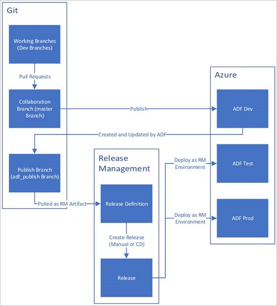

# CI/CD for Azure Data Factory

## Best practices

In this project, we are following exactly the best pratices recommended by Microsoft for CI/CD for Azure Data Factory.

The recommendation of Microsoft is summarized in the image below:



[Link to Microsoft Documentation](https://learn.microsoft.com/en-us/azure/data-factory/continuous-integration-delivery#best-practices-for-cicd)

# Deploy Flow
## Branching Strategy

| Branch        | Environment       | Content Type                | Flow                                                     | Activity                                                                                                                                                             |
| ------------- | ----------------- | --------------------------- | -------------------------------------------------------- | -------------------------------------------------------------------------------------------------------------------------------------------------------------------- |
| `feature/*`   | DEV               | JSON (editable)             | **Edit → Validate → Publish (DEV only)** → Save → Commit | Individual development in Azure Data Factory. Create/modify pipelines, datasets, linked services. |
| `main`        | DEV (integration) | JSON (approved / versioned) | Merge from `feature/*` → **Publish All**                 | Approved and integrated code. Source of truth before deployment |
| `adf_publish` | TEST / PROD       | ARM Templates + parameters  | Auto-generated from **Publish All** → CI/CD → Deploy     | **Deployment artifact branch**. Used by CI/CD to deploy consistently across environments       |

The `adf_publish` branch is a default branch automatically managed by Azure Data Factory when Git integration is enabled. During the first “Publish All” operation, ADF automatically generates this branch (if it does not already exist) and uses it to store the deployment artifacts in the form of ARM templates. 

From that point on, every publish action updates the `adf_publish` branch automatically, which is then used by CI/CD pipelines for deployment to TEST and PROD environments.


So, the deploy flow is:

```
feature/*
   |
   | (PR + merge)
   ↓
main
   |
   | ( `Publish All` in **Dev ADF environment**
   |  on **main** branch **triggers** CI/CD pipeline)
   | 
   ↓          ┌───► merge change of ARM templates to **`adf_publish`** branch
CD pipeline ──┼───► automatically deploy to 🧪 TEST environment
              └───► ⏸️ wait manual approval to deploy in PROD environment → Approval → 🚀 PROD environment
```

## CI/CD for Azure Data Factory — Deploy Flow

| Phase                 | Where you are    | Branch                           | Action                            | What happens                                    |
| --------------------- | ---------------- | -------------------------------- | --------------------------------- | ----------------------------------------------- |
| 1. Development        | DEV (ADF UI)     | `feature/*`                      | Edit → Validate → **Publish All** | Updates DEV runtime                             |
| 2. DEV Testing        | DEV              | `feature/*`                      | Run pipeline                      | Local testing in DEV                            |
| 3. Versioning         | DEV              | `feature/*`                      | Save → Commit                     | Code is saved in Git                            |
| 4. Integration        | GitHub           | `main`                           | PR + Merge                        | Code is approved                                |
| 5. Prepare Deployment | DEV (ADF UI)     | `main`                           | **Publish All**                   | Updates `adf_publish` (generates ARM templates) |
| 6. Deploy TEST        | Pipeline (CI/CD) | `adf_publish`                    | Automatic deploy                  | Publishes to TEST environment                   |
| 7. TEST Validation    | TEST             | `adf_publish`                    | Run pipelines / validations       | Confirms everything is working correctly        |
| 8. Promotion          | Pipeline (CI/CD) | `adf_publish`                    | **Approval (manual or gate)**     | Authorizes deployment to PROD                   |
| 9. Deploy PROD        | Pipeline (CI/CD) | `adf_publish`                    | Deploy                            | Publishes to PROD environment                   |


---

# Rollback Plan — ADF

Restore a previous stable version without creating divergence between environments. So, we have to indentify the last stable version and follows the same deploy flow in the same order.

```
main (restore the last stable version)
   |
   | ( `Publish All` in **Dev ADF environment**
   |  on **main** branch **triggers** CI/CD pipeline)
   | 
   ↓          ┌───► merge change of ARM templates to **`adf_publish`** branch
CD pipeline ──┼───► automatically deploy to 🧪 TEST environment
              └───► ⏸️ wait manual approval to deploy in PROD environment → Approval → 🚀 PROD environment
```

