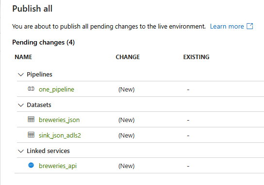

# Configuring the API job in ADF

## 🔹 Step 1 — Create HTTP Linked Service

1. Go to **Manage (⚙️)**
2. In **Linked services**: Search and select **HTTP**
3. Click **Continue**
4. In **New linked service**:
* **Name**: `breweries_api`
* **Base URL**: `https://api.openbrewerydb.org/v1/breweries`
* **Server certificate validation**: `disable`
* **Authentication**: `Anonymous` 
5. Click **Test connection** then  **Create**

## 🔹 Step 2 — Create Dataset for source

1. Go to **Author (✏️)** > **Datasets** > **+ New**
2. Search and select **HTTP**
3. Select format: `JSON`
4. Set properties:
* **Name**: `breweries_json`
* **Linked service**: select `breweries_api`
* **Import schema**: From connection / store
* **Request method**: `GET`
5. Click **OK**


## 🔹 Step 3 — Create Dataset for sink

The objective here is to create a reusable dataset for sink that writes in JSON format to ADLS Gen2.

1. Go to **Author (✏️)** > **Datasets** > **+ New**
2. Select **Azure Data Lake Storage Gen2** > Continue
3. Select format: **JSON** > Continue
4. Set properties:
* **Name**: `sink_json_adls2`
* **Linked service**:  New linked service : 
    * Name: `DataLakeStorageGen2Sink`
    * **Azure subscription**: select your Azure subscription
    * **Storage account name**: `devac1970496f74b3`
5. Create
6. Go to **Parameters** tab and create the following parameters:
    * **Name**: `p_container`
    * **Type**: `String`
    * **Default value**: `one`

    * **Name**: `p_folder`
    * **Type**: `String`
    * **Default value**: `raw`

    * **Name**: `p_file`
    * **Type**: `String`
    * **Default value**: `file.json`

7. Back to **Connection** tab, and add parameters to the file path:
* **Container**: `@dataset().p_container`
* **File path**: `@dataset().p_folder`
* **File name**: `@dataset().p_file`

## 🔹 Step 4 — Create Pipeline

1. Go to **Author (✏️)**
2. Click **+** → **Pipeline**
3. Select **Pipeline**
4. Set properties:

* **Name**: `one_pipeline`

## 🔹 Step 5 — Add Copy Activity

1. Open your **Pipeline**
2. Select **Move and transform** > **Copy Activity**
2. Drag it into the canvas
3. General:
* **Name**: `breweries`
* **Activity state**: Activated
* **Timeout**: 00:10:00
* **Retry**: 3
* **Retry interval**: 60 (seconds)


4. Source:
* **Source dataset**: `breweries_json`
* **Request method**: `GET`
* **Request timeout**: 00:00:02
* **Max concurrent connections**: 1
5. Sink:
* **Sink dataset**: `sink_json_adls2`
* **Copy behavior**: `preserve hierarchy`
* **Max concurrent connections**: 1
* **Block size (MB)**: 4
* **File path**: 
    
    * p_container: one
    * p_folder:
```
@concat(
    'raw/api/openbrewery/',
    formatDateTime(
        convertTimeZone(utcNow(),'UTC','E. South America Standard Time'),
        'yyyy/MM/dd'
    )
)
```
    * p_file:
```
@concat(
    'response_',
    formatDateTime(
        convertTimeZone(utcNow(),'UTC','E. South America Standard Time'),
        'HHmmss'
    ),
    '_',
    pipeline().RunId,
    '.json'
)
```     
* **Copy behavior**: Preserve hierarchy
* **Max concurrent connections**: 1
* **Block size (MB)**: 4

## 🔹 Step 6 — Trigger/schedule the pipeline
1. Add Trigger > New/Edit
2. Add new trigger:
* **Name**: daily
* **Type**: Schedule
* **Start date**: 4/22/2026, 12:00:00 AM
* **Time zone**: Brasilia (UTC-3)
* **Recurrence**: Every 1 Day(s)
* **Schedule execution times**: 01:00
* **Start trigger**: Start trigger on creation (enable)

## 🔹 Step 7 — Validate all

## 🔹 Step 8 — Plublish all



